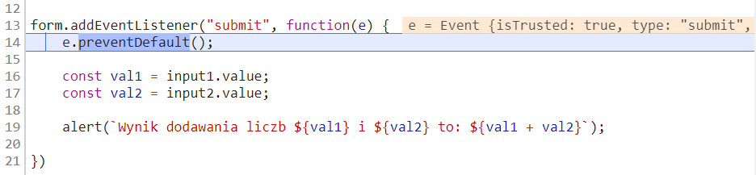
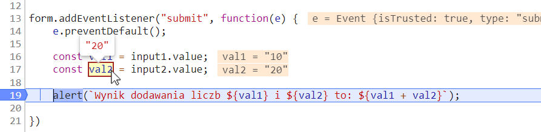

# Zadania - debuger
==========================

### Zadanie 1
--------------------------
Na naszej stronie znajduje się prosty formularz, który dodaje 2 liczby.
Niestety nie działa on najlepiej, bo wynik nie jest prawidłowy.

Jak otworzysz HTML, zobaczysz, że do naszej strony dodano kilka oddzielnych plików JS.
Żeby naprawić kod formularza, musimy sprawdzić w którym pliku on się znajduje.

Przejdź do zakładki Sources w debugerze. Po prawej stronie na dole będziesz miał opcję **Event Listener Breakpoints**.

Formularz odpala skrypt przy swojej wysyłce. Jest to zdarzenie Submit. Dodajmy zatrzymywanie wykonywania skryptu jeżeli przeglądarka wykryje takie zdarzenie.
Zaznacz więc zdarzenie Submit - mieści się ono w grupie **Control**.

Spróbuj jeszcze raz wypełnić formularz i go wysłać.

Skrypt powinien zatrzymać się w odpowiedniej funkcji (strona przyciemniała, pojawiła się ikonka play na jej śrdoku, a sam skrypt powinien zatrzymać się w odpowiedniej linii)

Przeanalizuj linie 12-20. Czemu ten kod wykonuje nieporawne dodawanie?

Aby to sprawdzić, postaw breakpoint w linii 18 klikając na numer linii 18. Kliknij ikonkę Resume (prawy górny róg zakładki lub klawisz F8).

Skrypt powinien zatrzymać się we wskazanym przez nas miejscu. W tym momencie możesz kursorem najeżdżać na wcześniejsze zmienne by zobaczyć ich wartość. Przy niektórych zmiennych dodatkowo debuger powinien pokazać ich wartość.

Widzisz w czym jest problem? Wartości pobrane z pól są typu tekstowego, a powinny być numerami.
Wiedząc w którym pliku się znajdujemy oraz w której linijce kod działa niepoprawnie napraw jego działanie.

## Materiały:
--------------------------
https://kursjs.pl/kurs/debuger/debuger.php