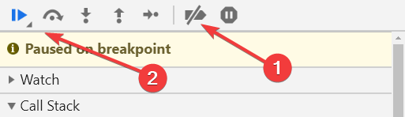
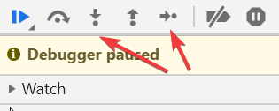
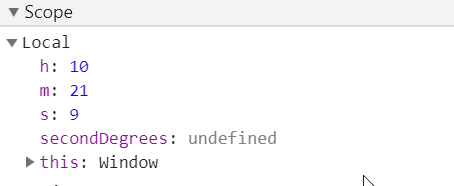

# Zadania - debugger
==========================


Na stronie znajdują się 2 zegarki. Jeden cyfrowy oraz drugi - wskazówkowy tle strony.
Może tego na pierwszy rzut oka nie widać, ale niestety strona nie działa prawidłowo, ponieważ działają tylko sekundy.


## Zadanie 1
--------------------------
Zacznijmy od naprawienia zegarka cyfrowego.
Zbadaj cyfry w zegarku cyfrowym (element .second) i dodaj im breakpointa zatrzymującego skrypt w przypadku modyfikacji html danego elementu. Aby to zrobić będąc w zakładce Elements debugera kliknij prawym przyciskiem myszy na dany element i z menu kontekstowego wybierz `Break on -> subtree modification`.

Wykonywanie skryptu powinno zatrzymać się w momencie modyfikacji tego elementu, czyli w 15 linijce pliku app.js.
Linijka ta ustawia tekst wewnątrz elementu pobranego ze strony. Gdy najedziesz na zmienną <strong>secondEl</strong>, zobaczysz, że jest to <strong>div.second</strong> (który jest pobierany na samym początku skryptu).
Analogicznie do linii w której zatrzymał się skrypt dodaj podobne ustawienia ale dla minut i godzin. Skorzystaj z odpowiednich parametrów (h, m, s) i odpowiednich elementów z początku strony.

Jeżeli skrypt zmieniasz bezpośrednio w debugerze, i będziesz chciał zapisać modyfikacje (Ctrl + S), przy nazwie pliku pojawi się ikona z wykrzyknikiem. Oznacza to, że twoje zmiany nie mogą być zapisane. Jeżeli chcesz dalej pracować bezpośrednio w debugerze, korzystając z zakładki Filesystem (po lewej stronie, tuż obok Page) musisz dodać do zapisu folder, w którym znajduje się to zadanie. Możesz też skrypt zmieniać w swoim edytorze.

Po zmianie skrypt wyłącz na chwilę breakpointy a następnie włącz wykonywanie skryptu.



Jeżeli wszystko poszło dobrze, zegarek powinien już działać prawidłowo.


## Zadanie 2
--------------------------
Włącz ponownie breakpointy (znowu ikonka 2). Skrypt ponownie zatrzyma się w okolicach poprzedniego miejsca.

Spróbujmy sprawdzić co się dzieje dalej w naszym skrypcie. Aby to zrobić kliknij ikonkę wyjścia z funkcji i przejścia do kolejnego kroku.


Skrypt zakończy wykonywanie funkcji setTimer() i przejdzie do kolejnej instrukcji, którą jest... wykonanie funkcji setClockHands().
Wejdźmy do jej środka i sprawdźmy co robi.



Gdy skrypt zatrzyma się w jej wnętrzu, zbadajmy dwie rzeczy. Po pierwsze zobaczmy czym jest zmienna clock najeżdżając na nią. To div o klasie .clock.
Sprawdźmy też do jakich zmiennych mamy dostęp w tej funkcji. Możemy to robić najeżdżając na parametry tej funkcji, lub używając zakładki Scope z prawej strony.



Kod w tej funkcji odpowiedzialny jest za ustawienie kąta dla wskazówki sekund. Robi to poprzez wyliczenie i ustawienie zmiennej `--second` w css za pomocą funkcji setProperty.

```js
function setClockHands(h, m, s) {
    const secondDegrees = ((s / 60) * 360);
    clock.style.setProperty('--second', `${secondDegrees}deg`);
}
```

Stwórzmy analogiczny kod dla minut i godzin.
Podobnie do tych 2 linijek musimy zmienić zmienne `--minutes` i `--hours`. Możesz się o tym przekonać wybierając w zakładce Sources z lewej strony plik style.css i przechodząc do 34 linijki kodu. Pamiętaj by przy wyliczaniu wykorzystać odpowiednie parametry funkcji.


## Zadanie 3
--------------------------
Wyłączmy wszystkie breakpointy - nawet te związane ze zmianą html - i przetestujmy działanie strony. Aby to najwygodniej zrobić z prawej strony w sekcji DOM Breakpoints kliknij prawym przyciskiem na tą sekcję i wybierz "Remove all DOM breakpoints".

Przejdźmy do ostatniej zmiany. Co 10 sekund tło strony się zmienia. Niestety zmienia się na kolory zbyt bure. W tak krótkim kodzie na jakim działamy nie będzie problemu odnaleźć jaka linijka zmienia to tło. Spróbujmy to zrobić jednak prawidłowo.
Przejdźmy do zakładki Elements, wybierzmy element body i dodajmy mu zatrzymanie skryptu w momencie zmiany koloru tła. Kliknij prawym klawiszem na body i z menu kontekstowego wybierz `Break on -> Attribute modifications`. Po odświeżeniu strony skrypt powinien zatrzymać się w odpowiednim momencie czyli w linii z kodem:

```
document.body.style.backgroundColor = generateRandomColor();
```

Tło strony ustawiane jest na wartość zwrócona przez funkcję generateRandomColor(). Sprawdźmy co się dzieje w jej wnętrzu klikając na ikonkę wejścia do środka funkcji.


Jak widzimy generowany jest randomowy kolor w zapisie hsl. Drugi parametr takiego zapisu to natężenie nasycenia koloru. W naszym przypadku wynosi 20%, co powoduje, że kolory są bure. Zmieńmy go na coś mocniejszego - od 60% do 100% powinno być ok. Wyłączmy wszystkie breakpointy i sprawdźmy działanie skryptu.


## Materiały:
--------------------------
https://kursjs.pl/kurs/debuger/debuger.php