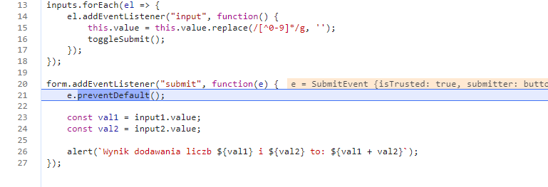
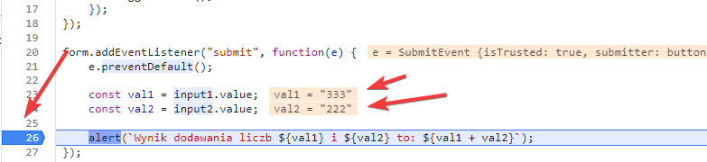

# Zadania - debuger
==========================

### Zadanie 1
--------------------------
Na naszej stronie znajduje się prosty formularz, który dodaje 2 liczby.
Niestety nie działa on najlepiej, bo wynik nie jest prawidłowy.

Jak otworzysz HTML, zobaczysz, że do naszej strony dodano kilka oddzielnych plików JS.
Żeby naprawić kod formularza, musimy sprawdzić, w którym pliku on się znajduje.

Przejdź do zakładki Sources w debugerze. Po prawej stronie na dole będziesz miał opcję **Event Listener Breakpoints**.

Formularz odpala skrypt przy swojej wysyłce. Jest to zdarzenie Submit. Dodajmy zatrzymywanie wykonywania skryptu, jeżeli przeglądarka wykryje takie zdarzenie.
Zaznacz więc zdarzenie Submit. Mieści się ono w grupie **Control**.

Spróbuj jeszcze raz wypełnić formularz i go wysłać.

Skrypt powinien zatrzymać się w odpowiedniej linijce (strona przyciemniała, pojawiła się ikonka play na środku strony)

Czemu ten kod wykonuje niepoprawne działanie?

Aby to sprawdzić, postaw breakpoint w linii z funkcją `alert(...)` klikając w numer linii. Kliknij ikonkę Resume (prawy górny róg zakładki lub klawisz F8).

Skrypt powinien zatrzymać się we wskazanym przez ciebie miejscu. W tym powinieneś też widzieć wartości niektórych zmiennych. Możesz też najechać kursorem na zmienne z wcześniejszych linii kodu, aby zobaczyć ich wartość. 

Widzisz, w czym jest problem? Wartości pobrane z pól są typu zawsze tekstowego.
Wiedząc, w którym pliku się znajdujemy, oraz w której linijce kod działa niepoprawnie napraw jego działanie.

## Materiały:
--------------------------
https://kursjs.pl/kurs/debuger/debuger.php